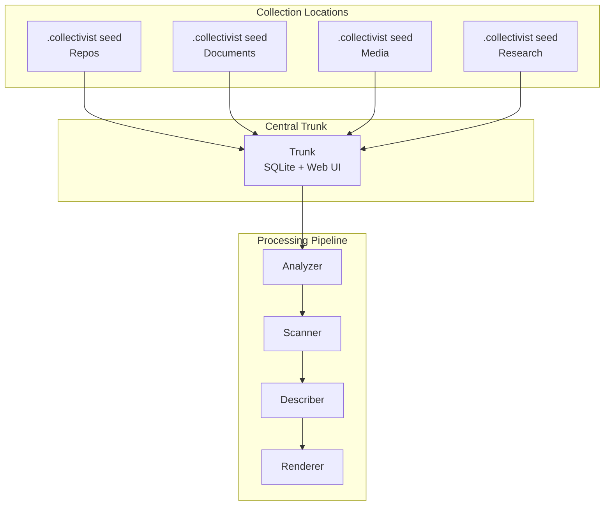

# Design Document

## Overview

Collectivist implements a distributed-to-centralized architecture for AI-powered collection curation. The system deploys portable `.collectivist` seeds across different collection locations that automatically centralize to a coordination trunk for unified processing and documentation generation.

## Architecture

The system follows a hub-and-spoke model:

- **Distributed Seeds**: `.collectivist` folders deployed at collection locations
- **Central Trunk**: Coordination point with SQLite storage and web interface
- **Processing Pipeline**: Four-stage flow (Analyzer → Scanner → Describer → Renderer)



## Components and Interfaces

### Collection Seeds
- **Location**: `.collectivist` folders at collection roots
- **Function**: Local processing and data generation
- **Output**: Collection-specific index files

### Trunk
- **Storage**: SQLite database for aggregated data
- **Interface**: Web interface via `collection.html`
- **Function**: Discovery, registration, and coordination

### Processing Pipeline

#### Analyzer
- **Input**: Collection directory structure
- **Output**: Collection type detection and structural analysis
- **Function**: Determines processing strategy

#### Scanner (Plugin Architecture)
- **Interface**: Standard plugin interface for domain-specific scanning
- **Plugins**: Repository, Document, Media, Research scanners
- **Fallback**: Generic file metadata extraction

#### Describer
- **Input**: Scanned metadata
- **Output**: AI-generated summaries and categorizations
- **LLM Integration**: Multiple provider support with fallback

#### Renderer
- **Input**: Analyzed and described data
- **Output**: README.md files and documentation
- **Templates**: Collection-type-specific formatting

## Data Models

### Collection Index Schema
```yaml
collection:
  type: [repository|document|media|research]
  location: string
  last_updated: timestamp
  items: []
```

### Item Metadata Schema
```yaml
item:
  path: string
  type: string
  metadata: {} # Domain-specific fields
  description: string # AI-generated
  categories: [] # AI-assigned
```

### Configuration Schema
```yaml
# Global config
llm:
  providers: []
  fallback_chain: []

processing:
  cache_enabled: boolean
  parallel_workers: integer

# Collection-specific config (.collection/config.yaml)
collection:
  type_override: string
  custom_templates: {}
  scanner_options: {}
```
## Correctness Properties

*A property is a characteristic or behavior that should hold true across all valid executions of a system-essentially, a formal statement about what the system should do. Properties serve as the bridge between human-readable specifications and machine-verifiable correctness guarantees.*

### Property 1: Collection Type Detection Consistency
*For any* collection directory with identifiable content patterns, the system should consistently detect the same collection type across multiple runs.
**Validates: Requirements 2.1, 2.5**

### Property 2: Scanner Plugin Routing
*For any* file type with a registered scanner plugin, the system should route that file to the correct scanner plugin.
**Validates: Requirements 3.2, 3.5**

### Property 3: Processing Pipeline Completeness
*For any* collection that successfully completes processing, all four pipeline stages (Analyzer → Scanner → Describer → Renderer) should execute in sequence.
**Validates: Requirements 4.1, 4.2, 4.3, 4.4**

### Property 4: Metadata Extraction Completeness
*For any* supported file type, the appropriate scanner should extract all required metadata fields for that type.
**Validates: Requirements 1.1, 1.2, 1.3, 1.4**

### Property 5: README Generation Consistency
*For any* collection type, the system should generate a README.md file using the appropriate template for that collection type.
**Validates: Requirements 6.1, 6.3**

### Property 6: Cache Behavior Correctness
*For any* unchanged file, subsequent processing runs should use cached results rather than re-processing.
**Validates: Requirements 9.1, 9.3**

### Property 7: Error Isolation
*For any* collection with some failing items, the system should continue processing remaining items and complete successfully.
**Validates: Requirements 10.1, 10.5**

### Property 8: Configuration Override Hierarchy
*For any* collection with both global and local configuration, local configuration should override global settings.
**Validates: Requirements 8.1, 8.2**

### Property 9: LLM Fallback Chain
*For any* LLM provider failure, the system should attempt the next provider in the fallback chain.
**Validates: Requirements 5.3, 5.4**

### Property 10: Collection Registry Maintenance
*For any* discovered `.collectivist` folder, the trunk should register it in the SQLite database with correct metadata.
**Validates: Requirements 12.1, 12.2**

## Error Handling

### Error Categories
- **Item-level errors**: Individual file processing failures
- **Service errors**: LLM provider unavailability
- **System errors**: File access permissions, disk space
- **Configuration errors**: Invalid YAML, missing required fields

### Error Recovery Strategies
- **Graceful degradation**: Continue processing without failed components
- **Retry with backoff**: For transient service failures
- **Partial progress preservation**: Save completed work before termination
- **Detailed logging**: Context-rich error messages for debugging

## Testing Strategy

### Dual Testing Approach
The system requires both unit tests and property-based tests for comprehensive coverage:

- **Unit tests**: Verify specific examples, edge cases, and error conditions
- **Property tests**: Verify universal properties across all inputs
- Together they provide comprehensive coverage (unit tests catch concrete bugs, property tests verify general correctness)

### Property-Based Testing Configuration
- Use appropriate property-based testing library for the implementation language
- Configure each test to run minimum 100 iterations
- Tag each test with format: **Feature: collectivist, Property {number}: {property_text}**
- Each correctness property must be implemented by a single property-based test

### Unit Testing Focus
- Specific examples demonstrating correct behavior
- Integration points between pipeline stages
- Edge cases and error conditions
- Configuration validation and error messages